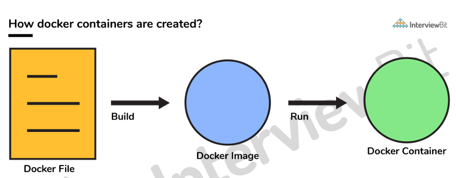
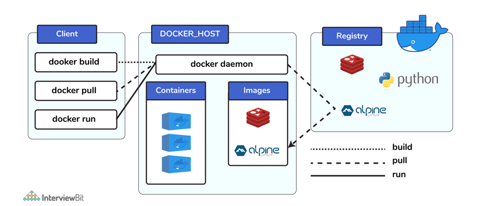
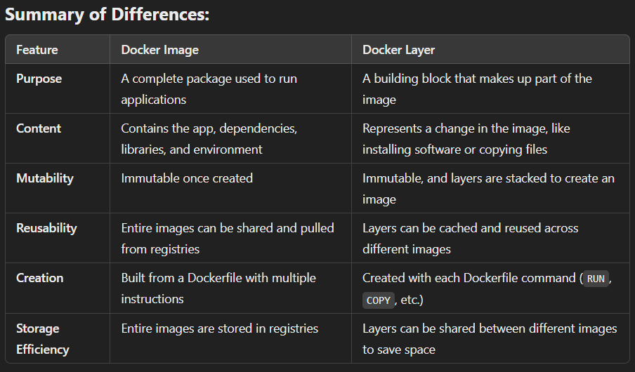

# Docker 

## 1. What is Container?

- Docker container is lightweight ,standalone and executable package that includes everything needed to run a software including code,libraries, runtime, system tools and settings etc..

- docker containers consist of applications and all their dependencies.They share the kernel and system resources with other containers and run asisolated systems in the host operating system.

-  Containers are created from images, which are essentially templates that define the environment and settings for a container.

### Key Features:
>- **Lightweight**: Containers are much lighter than virtual machines, as they share the host operating system.
  
>- **Isolation** : Containers encapsulate an application and its dependencies, helps prevent conflicts between different software versions and dependencies.

>- **Scalability and Modularity**: Applications can be broken down into smaller, manageable microservices, each running in its own container. This modularity simplifies scaling specific parts of an application independently based on demand.

>- **portability** 

### Use Cases :
>1. **Development and Testing**: 
Containers provide a consistent and reliable environment for developers to work in, ensuring.

> 2. **Continuous Integration/Continuous Deployment (CI/CD)**:
Automate the building, testing, and deployment of applications within containers to streamline the software release process.

<br>

## 2. Docker Images:
- Docker images are read-only templates that contain the instructions for creating a Docker container.

<br>

## 3. DockerFile

- It is a text file that has all commands which need to be run for building a given image.
  
<br>



<br>

## 4. Hypervisor

- A hypervisor plays a crucial role in enabling virtualization, allowing multiple virtual machines to run on a single physical machine. It helps improve resource utilization, flexibility, and isolation, making it indispensable in modern IT infrastructure, especially in data centers, cloud environments, and development environments.

> ### Types Of Hypervisor
>1. `Naive` :This type is also called a Bare-metal Hypervisor and runs
 directly on the underlying host system which also ensures direct access to the host hardware which is why it does not require base OS.

 >2. `Hosted Hypervisor`: This type makes use of the underlying host operating system which has the existing OS installed.

<br>

## 5. Docker Compose
- It is a YAML file consisting of all the details regarding various services, networks, and
 volumes that are needed for setting up the Docker-based application. 

 - So, docker compose is used for creating multiple containers, host them and establish
 communication between them. For the purpose of communication amongst the
 containers, ports are exposed by each and every container.

 
 ### Key Concepts of Docker Compose:

>1. <u>**Multi-Container Applications**:</u>
Compose allows you to manage multiple Docker containers that work together to form a complete application. Each container represents a service, such as a web server, database, or message queue.


>2. <u>**Declarative Configuration**:</u>
The services, networks, and volumes are declared in a docker-compose.yml file. This makes it easy to define the relationships between services and how they should be orchestrated.

>3. <u>**Easy Management**:></u>
With a single command, you can build, start, stop, or scale all services defined in the docker-compose.yml file, making it easier to manage complex applications.

>4. <u>**Networking**:</u>
Compose automatically sets up a network between the containers so that they can communicate with each other. Containers within the same network can reach each other by their service name.

>5. <u>**Volume Management**:</u>
It handles the persistence of data using volumes, so you can easily store and share data across containers.

<br>

## 6. In order to get the status of all the containers, we run the below command: `docker ps -a`

<br>

## 7. What is docker image registry?
- Docker image registry is a central location where Docker images are stored and can be shared among users.
  
- Instead of converting the applications to containers each and every time,
 a developer can directly use the images stored in the registry.

 - This image registry can either be public or private and Docker hub is the most
 popular and famous public registry available.

 <br>

## 8. why image stored in registry is used to run the application instrad of converting the application into containers each and every time?
- `Efficiency`: Speeds up container creation by reusing pre-built images.
  
- `Consistency`: Guarantees the same environment across different stages.
  
- `Portability`: Enables seamless deployment on any platform.
  
- `Resource Saving`: Reduces resource consumption by avoiding repeated builds.
  
- `Version Control`: Simplifies managing different application versions.
  
- `Faster Scaling`: Makes scaling and deployments faster.
  
- `Security`: Allows pre-checking for vulnerabilities in images.

<br>

## 10.  How many Docker components are there?

 - There are three docker components, they are - Docker Client, Docker Host, and
 Docker Registry.
 > 1. <u>`Docker Client`</u>: This component performs “build” and “run” operations for the
 purpose of opening communication with the docker host.

 >2. <u>`Docker Host`</u>: This component has the main docker daemon and hosts
 containers and their associated images. The daemon establishes a connection
 with the docker registry.

 >3. <u>`Docker Registry`</u>: This component stores the docker images. There can be a
 public registry or a private one. The most famous public registries are Docker
 Hub and Docker Cloud.

<br>

 

 <br>

 ## 11. What is a Docker Hub?

- It is a public cloud-based registry provided by Docker for storing public images of
 the containers along with the provision of finding and sharing them.

 - The images can be pushed to Docker Hub through the `docker push` command.

<br>

## 12. Command to export a docker image as an archive :

<h3>

 `docker save -o <exported_name>.tar <container-name>` 
 </h3>

 <br>

 ## 13. Command to import a pre-exported Docker image into another Docker host:
 <h3>

 `docker load -i  <export_image_name>.tar`
 </h3>

<br>

## 14. Can a paused container be removed from Docker?
 - No, it is not possible! A container MUST be in the stopped state before we can
 remove it

 <br>

 ## 15. Virtualization vs Containerization

| **Virtualization** | **Containerization** |
| ------------- |-----------------|
| allows you to run multiple operating systems  on one physical machine (host).   |Containerization allows you to run multiple applications on a single OS by packaging them in containers.|
|Each OS runs in its own virtual machine (VM).|Each container shares the host’s operating system but runs the application and its dependencies in isolation. |
|`Hypervisors` provide overall virtual machines to the guest operating systems. | `Containers` ensure isolated environment/ user spaces are provided for running the applications. Any changes done within the container do not reflect on the host or other containers of the same host. |

<br> 

##   16.   Differentiate between COPY and ADD commands that are used in a Dockerfile?
- `COPY` is more preferred because of its higher transparency level than that of ADD .
-  `COPY` provides just the basic support of copying local files into the container
 whereas `ADD` provides additional features like remote URL and tar extraction
 support.

<br>

 ## 17. Docker images vs layers:

 - A `Docker image` is the final product, used to run an application in a container.
- `Layers` are the individual steps or changes that build up the image, allowing Docker to optimize builds and reduce redundancy by caching and reusing them.

<br>



###     Dockerfile
```
FROM ubuntu:20.04   # Base layer

RUN apt-get update  # New layer (install dependencies)

COPY . /app         # New layer (copy application files)

CMD ["python3", "app.py"]  # This adds metadata, not a new layer
```


## 18. Docker Volume

Docker volumes are used to store and persist data outside of the container's lifecycle.

`They are useful for`:
- Persisting data across container restarts.
- Sharing data between multiple containers.
- Backing up and managing application data.
- Volumes provide a more efficient and secure way to handle persistent data in Docker than alternative methods like bind mounts.
  
> By using volumes, you can ensure your applications' data remains safe and available, no matter what happens to your containers.

<br>

## 19. Most commanly used instructions in dockerfile:

 - `FROM`: This is used to set the base image for upcoming instructions. A docker file is considered to be valid if it starts with the FROM instruction.
  
 - `LABEL`: This is used for the image organization based on projects, modules, or licensing. It also helps in automation as we specify a key-value pair while defining a label that can be later accessed and handled programmatically.
  
 - `RUN`: This command is used to execute instructions following it on the top of the current image in a new layer. Note that with each RUN command execution, we add layers on top of the image and then use that in subsequent steps.
  
 - `CMD`: This command is used to provide default values of an executing container.
 In cases of multiple CMD commands the last instruction would be considered.

 <br>

 ## 20 . What is the way to establish communication between docker host and Linux host?

 - This can be done using networking by identifying the “ipconfig” on the docker host.
 - This command ensures that an ethernet adapter is created as long as the docker is present in the host.


## All Docker Commands

```
{
  "docker_commands": [
    {
      "command": "docker build",
      "description": "Build an image from a Dockerfile."
    },
    {
      "command": "docker run",
      "description": "Run a command in a new container."
    },
    {
      "command": "docker ps",
      "description": "List running containers."
    },
    {
      "command": "docker images",
      "description": "List Docker images."
    },
    {
      "command": "docker pull",
      "description": "Pull an image or a repository from a registry."
    },
    {
      "command": "docker push",
      "description": "Push an image or a repository to a registry."
    },
    {
      "command": "docker exec",
      "description": "Run a command in a running container."
    },
    {
      "command": "docker stop",
      "description": "Stop one or more running containers."
    },
    {
      "command": "docker start",
      "description": "Start one or more stopped containers."
    },
    {
      "command": "docker rm",
      "description": "Remove one or more containers."
    },
    {
      "command": "docker rmi",
      "description": "Remove one or more images."
    },
    {
      "command": "docker logs",
      "description": "Fetch the logs of a container."
    },
    {
      "command": "docker inspect",
      "description": "Return low-level information on Docker objects."
    },
    {
      "command": "docker network ls",
      "description": "List all Docker networks."
    },
    {
      "command": "docker network create",
      "description": "Create a new Docker network."
    },
    {
      "command": "docker network rm",
      "description": "Remove one or more Docker networks."
    },
    {
      "command": "docker volume ls",
      "description": "List all Docker volumes."
    },
    {
      "command": "docker volume create",
      "description": "Create a new Docker volume."
    },
    {
      "command": "docker volume rm",
      "description": "Remove one or more Docker volumes."
    },
    {
      "command": "docker tag",
      "description": "Create a tag TARGET_IMAGE that refers to SOURCE_IMAGE."
    },
    {
      "command": "docker commit",
      "description": "Create a new image from a container’s changes."
    },
    {
      "command": "docker cp",
      "description": "Copy files/folders between a container and the local filesystem."
    },
    {
      "command": "docker events",
      "description": "Get real time events from the server."
    },
    {
      "command": "docker history",
      "description": "Show the history of an image."
    },
    {
      "command": "docker info",
      "description": "Display system-wide information."
    },
    {
      "command": "docker kill",
      "description": "Kill one or more running containers."
    },
    {
      "command": "docker load",
      "description": "Load an image from a tar archive or STDIN."
    },
    {
      "command": "docker login",
      "description": "Log in to a Docker registry."
    },
    {
      "command": "docker logout",
      "description": "Log out from a Docker registry."
    },
    {
      "command": "docker pause",
      "description": "Pause all processes within one or more containers."
    },
    {
      "command": "docker port",
      "description": "List port mappings or a specific mapping for the container."
    },
    {
      "command": "docker rename",
      "description": "Rename a container."
    },
    {
      "command": "docker restart",
      "description": "Restart one or more containers."
    },
    {
      "command": "docker search",
      "description": "Search the Docker Hub for images."
    },
    {
      "command": "docker top",
      "description": "Display the running processes of a container."
    },
    {
      "command": "docker unpause",
      "description": "Unpause all processes within one or more containers."
    },
    {
      "command": "docker update",
      "description": "Update configuration of one or more containers."
    },
    {
      "command": "docker version",
      "description": "Show the Docker version information."
    },
    {
      "command": "docker wait",
      "description": "Block until a container stops, then print its exit code."
    },
    {
      "command": "docker attach",
      "description": "Attach local standard input, output, and error streams to a running container."
    },
    {
      "command": "docker diff",
      "description": "Inspect changes to files or directories on a container’s filesystem."
    },
    {
      "command": "docker export",
      "description": "Export a container’s filesystem as a tar archive."
    },
    {
      "command": "docker import",
      "description": "Import the contents from a tarball to create a filesystem image."
    },
    {
      "command": "docker save",
      "description": "Save one or more images to a tar archive."
    },
    {
      "command": "docker stats",
      "description": "Display a live stream of container(s) resource usage statistics."
    },
    {
      "command": "docker swarm init",
      "description": "Initialize a swarm on this node."
    },
    {
      "command": "docker swarm join",
      "description": "Join a swarm as a node."
    },
    {
      "command": "docker swarm leave",
      "description": "Leave the swarm."
    },
    {
      "command": "docker service create",
      "description": "Create a new service."
    },
    {
      "command": "docker service ls",
      "description": "List services in the swarm."
    },
    {
      "command": "docker service ps",
      "description": "List the tasks of a service."
    },
    {
      "command": "docker service update",
      "description": "Update a service."
    },
    {
      "command": "docker service rm",
      "description": "Remove one or more services."
    },
    {
      "command": "docker stack deploy",
      "description": "Deploy a new stack or update an existing stack."
    },
    {
      "command": "docker stack ls",
      "description": "List stacks."
    },
    {
      "command": "docker stack services",
      "description": "List the services in a stack."
    },
    {
      "command": "docker stack rm",
      "description": "Remove one or more stacks."
    },
    {
      "command": "docker secret create",
      "description": "Create a new secret."
    },
    {
      "command": "docker secret ls",
      "description": "List secrets."
    },
    {
      "command": "docker secret inspect",
      "description": "Display detailed information on one or more secrets."
    },
    {
      "command": "docker secret rm",
      "description": "Remove one or more secrets."
    },
    {
      "command": "docker config create",
      "description": "Create a new config."
    },
    {
      "command": "docker config ls",
      "description": "List configs."
    },
    {
      "command": "docker config inspect",
      "description": "Display detailed information on one or more configs."
    },
    {
      "command": "docker config rm",
      "description": "Remove one or more configs."
    },
    {
      "command": "docker-compose up",
      "description": "Build, (re)create, start, and attach to containers for a service."
    },
    {
      "command": "docker-compose down",
      "description": "Stop and remove containers, networks, images, and volumes."
    },
    {
      "command": "docker-compose build",
      "description": "Build or rebuild services."
    },
    {
      "command": "docker-compose ps",
      "description": "List containers."
    },
    {
      "command": "docker-compose logs",
      "description": "View output from containers."
    },
    {
      "command": "docker-compose stop",
      "description": "Stop services."
    },
    {
      "command": "docker-compose exec",
      "description": "Execute a command in a running service container."
    },
    {
      "command": "docker-compose restart",
      "description": "Restart services."
    },
    {
      "command": "docker-compose pull",
      "description": "Pull service images."
    },
    {
      "command": "docker-compose push",
      "description": "Push service images."
    },
    {
      "command": "docker-compose scale",
      "description": "Set number of containers for a service."
    },
    {
      "command": "docker-compose config",
      "description": "Validate and view the Compose file."
    }
  ]
}
```