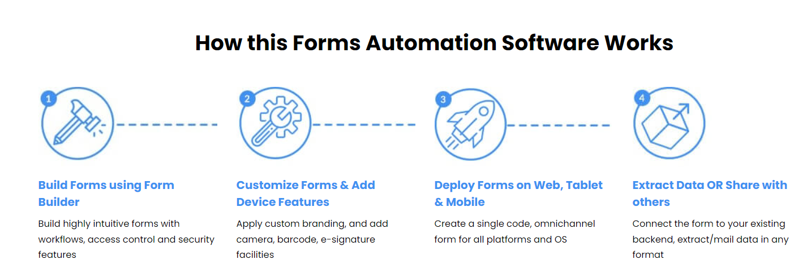

## Streebo offers a range of infrastructure services including installation, configuration, environment setup, migration, and deployment.

### Streebo provides a wide range of digital transformation solutions, including web and mobile applications tailored for various business functions such as Marketing, Sales, HR, and IT. Their offerings leverage automation and AI technologies from leading providers like IBM and Google. Additionally, Streebo offers comprehensive insurance solutions, including apps for sales agents, customer self-service, employee training, and claims adjustment. Their omni-channel solutions can integrate with existing systems.

### `Omni channel`: Omnichannel refers to a customer-centric approach that integrates and synchronizes multiple communication and purchase channels to deliver a seamless, consistent, and personalized customer experience.

### `Digital Transformation`: Digital transformation is the integration of digital technology into all areas of a business'

 

# `Key Softwares`:

# 1. Mobile Forms :
Streebo’s Form automation Software will help you convert all your enterprise forms to mobile, thus improving your data collection and driving productivity at large. Built using IBM’s Forms Experience Builder, this mobile forms solution will help you migrate all enterprise-ready forms to mobile quickly.

 

# 2. Streebo's DX Accelerator

- Streebo developed the DX Accelerator platform to streamline the application rollout cycle and meet the business's time requirements.
- The platform allows users with limited technical knowledge to build, assemble, and deploy multi-channel applications quickly, reducing development costs and time to market.
- The platform includes a fully customizable workflow engine to ensure the entire application release process remains under IT governance.
  
## Conversational Interface
- The DX Accelerator platform provides a multilingual conversational interface without any coding efforts, enabling users to interact with applications using natural language.
- This conversational platform can transform customer and employee experiences by providing easy access to information and functionality through natural language interactions.
  
## Benefits for Business
- The DX Accelerator platform empowers business users to create applications themselves, reducing the burden on IT departments.
- The conversational interface can enhance customer experience by providing a seamless, familiar interaction channel, increasing adoption and engagement.151617
The platform can help organizations transform their workplaces and increase the efficiency of internal processes through the conversational interface.

 

# 3. Streebo's chatbot builder

Streebo's chatbot builder software is a platform that enables users to create and deploy AI-powered chatbots. These chatbots can be integrated into various applications and platforms to provide automated customer service, answer questions, and perform other tasks. The software likely offers a user-friendly interface for building and customizing chatbots, as well as features for training them on specific datasets.
