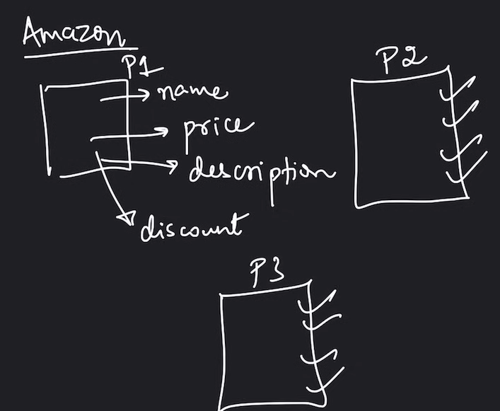

# C++

## Objects:
- Objects are entities in the real world.
- Object is an instance of a class.


## Classes
- Class is like a blueprint of these entities
- work of the blueprint is to display how this object will appear.
- it can also be called group of objects.
- It defines the properties and methods of an object

- Eg.
tata internally created bluprint of the car that they will be created.then by viewing blueprint it will create car1 car2 etc..

## Proper Example:

Instead of creating lots of variables in code, OOPS concepts says: create a class and then create objects.`no need to repeat the code`

`When`:create when objects closed to real world entities and we need to implement properties and methods for that entity



<br>

## Access Modifiers:


## Encapsulation :
- Wrapping up of data & member functions in single unit called class,so that private members can't be accessed outside the classs directly
- helps in date hiding


## Constructor:
- Special method ,that is automatically invoked at the time of object creation. Used for initialisation.

### Charecteristics:
-  It has same name as class name.
-  constructor doesn't have return type
-  Only called Once (automatically) at the time of creation
-  memory allocation is happened when constuctor is called.
-  Always declare constuctor as private,because main method always calls constuctor.
  

### `Types`:
- Copy constructor
- parametherized constuctor
- non-parameterized constructor

 ## `constructors declared with same name but diffferent parameters is called constructor overloding`

 ### 1. Copy Constructor
 - It is used to create a copy of an existing object.
 - used to copy properties of one object into constructor.

 ## This:
 - It is a special pointer that points to current object.
 - Using this we can know that this the object's property.

- There can be 3 main uses of ‘this’ keyword:
   1. It can be used to pass the current object as a parameter to another method
   2. It can be used to refer to the current class instance variable.
   3. It can be used to declare indexers.


<br>

## Shallow copy and deep copy

### 1. Shallow Copy
- Definition: A shallow copy of an object copies all of the member field values directly. If a field is a pointer, the shallow copy will copy the pointer but not the object it points to. This means both the original and the copied objects will point to the same memory location.
  
- Potential Issues: Since both objects share the same memory, modifying the data through one object affects the other. Moreover, when either object is destroyed, it might free the same memory twice, leading to undefined behavior (e.g., double free).  
  
```cpp
#include <iostream>
class ShallowCopy {
public:
    int* data;

    // Constructor
    ShallowCopy(int val) {
        data = new int(val);  // Dynamic allocation
    }

    // Destructor
    ~ShallowCopy() {
        delete data;
    }
};

int main() {
    ShallowCopy obj1(10);
    ShallowCopy obj2 = obj1;  // Shallow copy, obj2.data points to the same memory as obj1.data

    std::cout << "obj1 data: " << *obj1.data << std::endl;  // 10
    std::cout << "obj2 data: " << *obj2.data << std::endl;  // 10

    // Issue: When obj1 or obj2 is destroyed, the same memory is freed twice!
    return 0;
}

```
### 2. Deep Copy
- Definition: A deep copy duplicates not only the member field values but also the objects they point to. For pointer fields, the deep copy will allocate new memory and copy the actual data. This ensures the original and copied objects are completely independent.
 
- Benefits: Modifying one object does not affect the other, and each object is responsible for managing its own memory without causing issues like double freeing.

```cpp
#include <iostream>
class DeepCopy {
public:
    int* data;

    // Constructor
    DeepCopy(int val) {
        data = new int(val);  // Dynamic allocation
    }

    // Deep Copy Constructor
    DeepCopy(const DeepCopy& source) {
        data = new int(*source.data);  // Allocate new memory and copy data
    }

    // Destructor
    ~DeepCopy() {
        delete data;
    }
};

int main() {
    DeepCopy obj1(10);
    DeepCopy obj2 = obj1;  // Deep copy, obj2 gets its own copy of the data

    std::cout << "obj1 data: " << *obj1.data << std::endl;  // 10
    std::cout << "obj2 data: " << *obj2.data << std::endl;  // 10

    *obj2.data = 20;  // Changing obj2's data should not affect obj1

    std::cout << "obj1 data: " << *obj1.data << std::endl;  // 10
    std::cout << "obj2 data: " << *obj2.data << std::endl;  // 20

    return 0;
}
```

<br>

## Destructor:
- A destructor works opposite to constructor;it destructs the
 objects of classes. It can be defined only once in a class. Like constructors, it is invoked automatically. 

 - A destructor is definedlike a constructor. It must
 have the same name asclass, prefixed with atildesign (~)

 <br>

 ## inheritance:
 - Inheritance is a mechanism by which one class can inherit the properties of another class. 
 - properties and member functions of base class are passed to derived class
 - used for code reusability : we don't have to write properties again and again instead derive it from base class

### Modes of inheritance:


### Types:
- **Single Inheritance:** One derived class inherits from one base class
  
- **Multiple inheritance**: A class inherits properties and behavior from more than one parent class, creating a network-like inheritance structure.
  
- **Multilevel inheritance**: A class inherits from another derived class, creating a linear hierarchy.

- **Hierarchical Inheritance** :
- 

- **Hybrid Inheritance** : mix of all categories


## polymorphism:
- Polymorphism is the ability of an object to take on multiple forms. This can be achieved through overloading and overriding.
  
## 1. Compile time polymorphism (stitic binding)
### `polymorphism is a ability of object to take on different forms or behave in different ways depending on the context in which they are used` 

- It is also known as constructor overloading,function overloading.
- It is resolved at compile time.

### Constructor Overloading:
- allows a class to have more than one constructor, each with different parameters.
-  This feature enables the creation of objects in different ways depending on the arguments passed.
-   The compiler differentiates constructors by the number and type of parameters.
-   

### function Overloading:
- allows a class to have more than one function with the same name but different parameters.


## 2. Runtime polymorphism

Function overriding:
- allows a derived class to provide a specific implementation of a function that is already available in its base.

- parent and child both contain same function but different implementation.

- parent class is called overriden

- child class is called overriding

### Virtual functions:
A virtual function is a member function which is present in the base class and redefined by the derived class.

`Characteristics:`
- It is declared using the keyword virtual inside a base class and are always declared inside a base class and overridden in child class.
- dynammic in nature
- called during runtime.

## Abstaction:
- Abstraction is the concept of showing only necessary information to the outside world while hiding the internal details.
- to implement we use access modifiers/specifiers

### using abstract class:
- doesn't create any objects
- used to provide a base class from which other class can be derived
- used to define interface for derived class


<br>

## static keyword:
- Static keyword is used to create a static variable or method.
- created and instantiated once for the lifetime of the program

- static variables in class are created and instatiated once.they are shared by all the objects in class

<br>

## Friend Function:
- protected and private data members of a class can be accessed using this function.
-  can be defined inside the class or outside the class.
-  
```cpp
#include <iostream>    
using namespace std;    
class Box    
{    
    private:    
        int length;    
    public:    
        Box(): length(0) { }    
        friend int printLength(Box); //friend function    
};    
int printLength(Box b)    
{    
   b.length += 10;    
    return b.length;    
}    
int main()    
{    
    Box b;    
    cout<<"Length of box: "<< printLength(b)<<endl;    
    return 0;    
}    
```

<br>

## Pointers
- pointers are variables that stores the address of other variables.


