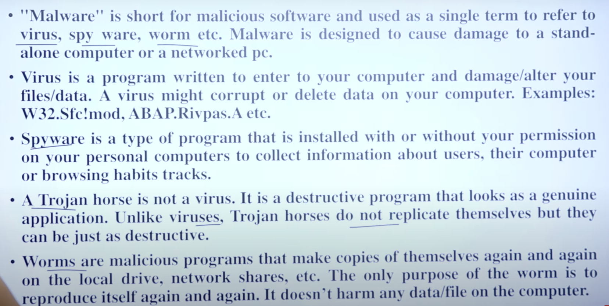

# OS

# 1. Process Control Block (PCB)

The Process Control Block (PCB) is a data structure used by computer operating systems to store all the information about processes. It contains information such as:

- **Process ID**: A unique identifier for the process.
- **Process State**: The current state of the process (new, ready, running, waiting, or terminated).
- **Program Counter**: The address of the next instruction to be executed.
- **Registers**: The contents of the CPU registers when the process was last interrupted.
- **Memory Management Information**: Information about the memory allocated to the process.
- **Open Files**: A list of files that are currently open by the process.
- **I/O Status Information**: Information about the I/O devices that are currently being used by the process.
- **Accounting Information**: Information about the resources used by the process, such as CPU time and memory usage.

#### Advantages of PCB

- Efficient process management
- Efficient resource allocation
- Improved system performance
- Better process synchronization

#### Disadvantages of PCB

- Increased memory usage
- Increased complexity
- Difficulty in implementing and managing PCBs

#### Location of PCB

The PCB is stored in a protected area of memory that is inaccessible to normal users. This is to prevent unauthorized access to sensitive process information.

### Process States

- **New**: The process is created and is being loaded into memory.
- **Ready**: The process is waiting for the CPU to become available to execute it.
- **Running**: The process is currently being executed by the CPU.
- **Waiting**: The process is waiting for some event to occur, such as I/O completion.
- **Terminated**: The process has finished executing and is being removed from memory.

 

# 2. Mutex vs Binary Semaphore

Mutexes and binary semaphores are both synchronization mechanisms used in concurrent programming to manage access to shared resources and ensure mutual exclusion. However, they have distinct characteristics and use cases.

#### Mutex (Mutual Exclusion)

- **Definition**: A mutex is a locking mechanism that allows only one thread to access a resource at a time.
- **Ownership**: Mutexes are owned by the thread that locks them. Only the thread that has acquired the mutex can release it.
- **Use Case**: Typically used when a thread needs exclusive access to a resource, such as a shared variable or data structure.
- **Blocking**: If a thread tries to lock a mutex that is already locked, it will block until the mutex is available.
- **Performance**: Generally more efficient for protecting resources since they are specifically designed for mutual exclusion.

#### Binary Semaphore

- **Definition**: A binary semaphore is a signaling mechanism that can take on two values (0 or 1) and is used for synchronization between threads.
- **Ownership**: Binary semaphores do not have ownership. Any thread can signal (release) the semaphore, regardless of which thread waited on it.
- **Use Case**: Often used for signaling between threads, such as indicating that a resource is available or a condition has been met.
- **Blocking**: Similar to mutexes, if a thread tries to wait on a binary semaphore that is already 0, it will block until the semaphore is signaled.
- **Flexibility**: More flexible than mutexes, as they can be used for signaling between multiple threads.

#### Summary of Differences

| Feature     | Mutex                        | Binary Semaphore                  |
|-------------|------------------------------|-----------------------------------|
| Ownership   | Owned by the locking thread  | No ownership                      |
| Purpose     | Mutual exclusion             | Signaling between threads         |
| Use Case    | Protecting shared resources  | Coordinating actions              |
| Performance | Generally more efficient     | More flexible                     |

#### Conclusion

- Use mutexes when you need to ensure that only one thread can access a resource at a time.
- Use binary semaphores when you need to signal between threads or when multiple threads may need to release the semaphore.

 

# 3. Process vs Threads

#### Processes

- **Definition**: A process is an independent program in execution, which includes its own memory space and resources.
- **Memory**: Each process has its own address space, which means that memory is isolated from other processes. This provides protection and stability.
- **Overhead**: Creating and managing processes involves significant overhead due to the need for memory allocation and context switching.
- **Communication**: Inter-process communication (IPC) is required for processes to communicate, which can be more complex and slower (e.g., using pipes, message queues, shared memory).
- **Resource Allocation**: Processes are allocated resources by the operating system, which can lead to higher resource consumption.
- **State**: Processes can be in various states (new, ready, running, waiting, terminated) as managed by the OS.

#### Threads

- **Definition**: A thread is a smaller unit of execution within a process. Threads share the same memory space and resources of their parent process.
- **Memory**: Threads within the same process share the same address space, which allows for faster communication and data sharing.
- **Overhead**: Creating and managing threads is generally more efficient than processes due to lower overhead and faster context switching.
- **Communication**: Threads can communicate more easily since they share the same memory space, making data sharing straightforward but also increasing the risk of data corruption.
- **Resource Allocation**: Threads are lighter in terms of resource allocation, allowing for more concurrent executions within a single process.
- **State**: Threads can also be in various states (ready, running, waiting), but their management is handled within the context of the parent process.

#### Summary of Differences

| Feature             | Process                        | Thread                          |
|---------------------|--------------------------------|---------------------------------|
| Independence        | Independent execution          | Dependent on the parent process |
| Memory Allocation   | Separate memory space          | Shared memory space             |
| Overhead            | Higher overhead                | Lower overhead                  |
| Communication       | More complex (IPC required)    | Easier (shared memory)          |
| Resource Management | Heavier resource allocation    | Lighter resource allocation     |

#### Conclusion

- Use processes when you need isolation and protection between different executing programs.
- Use threads when you need lightweight, efficient multitasking within a single application.

 

# 4. Monolithic vs Microkernel

#### Monolithic Kernel

- **Definition**: A monolithic kernel is a single large program that runs entirely in a single address space. It includes all the essential services of the operating system, such as device drivers, file system management, and system calls.
- **Architecture**: All operating system services run in kernel space. Direct communication between different components, leading to faster performance.
- **Advantages**:
    - **Performance**: Faster execution as all components run in the same address space with minimal overhead.
    - **Simplicity**: Easier to manage and develop since all components are part of a single codebase.
- **Disadvantages**:
    - **Stability**: A bug in any part of the kernel can crash the entire system.
    - **Modularity**: Difficult to extend or modify; adding new features may require recompiling the entire kernel.
    - **Security**: More susceptible to security vulnerabilities since all components have access to the same memory space.
- **Examples**: Linux, Unix.

#### Microkernel

- **Definition**: A microkernel is a minimalistic kernel that provides only the most essential services, such as basic scheduling, inter-process communication (IPC), and low-level memory management. Other services like device drivers and file systems run in user space.
- **Architecture**: Minimal kernel functionality, with most services running outside the kernel. Components communicate through message passing, which can introduce some overhead.
- **Advantages**:
    - **Stability**: A failure in a user-space service does not crash the entire system; the kernel remains intact.
    - **Modularity**: Easier to extend and maintain, as components can be modified or replaced without affecting the kernel.
    - **Security**: Better isolation between components, reducing the attack surface.
- **Disadvantages**:
    - **Performance**: Potentially slower due to the overhead of message passing and context switches between user space and kernel space.
    - **Complexity**: More complex design and implementation, as communication between components must be explicitly defined.
- **Examples**: Minix, QNX, L4.

#### Summary of Differences

| Feature     | Monolithic Kernel               | Microkernel                        |
|-------------|----------------------------------|------------------------------------|
| Structure   | Single large program            | Minimal core with services in user space |
| Performance | Generally faster                | Potentially slower due to IPC overhead |
| Stability   | Less stable (single failure can crash system) | More stable (isolated failures)    |
| Modularity  | Less modular                    | Highly modular                     |
| Security    | More vulnerable                 | More secure                        |

#### Conclusion

- **Monolithic kernels** are suitable for systems where performance is critical and stability can be managed, such as servers and high-performance computing.
- **Microkernels** are ideal for systems requiring high reliability and security, such as embedded systems and critical applications.

 

# 5. What is System Call?

A system call is a mechanism that allows a program to request a service from the operating system's kernel. It acts as an interface between user applications and the operating system, enabling programs to perform operations that require higher privileges, such as interacting with hardware, managing files, or creating processes.

#### Key Points

- **Purpose**: System calls provide controlled access to hardware and system resources.
- **Types**: Common types of system calls include:
    - **File Operations**: Open, read, write, close files.
    - **Process Control**: Create, terminate, and manage processes.
    - **Communication**: Send and receive messages between processes.
    - **Device Management**: Interact with hardware devices.
- **Examples**: In Unix-like operating systems, common system calls include `fork()`, `exec()`, `read()`, and `write()`.

#### How System Calls Work

- **User Mode vs. Kernel Mode**:
    - Programs run in user mode, which restricts access to certain resources for safety and stability.
    - System calls switch the program to kernel mode, where it has full access to hardware and system resources.
- **Invocation**:
    - A program typically invokes a system call through a library function (e.g., `open()` in C).
    - This function prepares the necessary arguments and triggers a software interrupt to switch to kernel mode.
- **Execution**:
    - The operating system processes the request, performs the necessary operations, and returns the result back to the user program.
- **Return to User Mode**:
    - After the system call is completed, control returns to the user program, which can then continue its execution.

 

# 6. Demand Paging

Demand Paging is a technique used to manage memory in operating systems. It's based on the concept of paging, where the physical memory is divided into fixed-size blocks called frames, and the virtual memory is divided into fixed-size blocks called pages.

#### How Demand Paging Works

1. The operating system divides the physical memory into frames and the virtual memory into pages.
2. When a process is executed, the operating system creates a page table to keep track of the pages allocated to the process.
3. The page table contains an entry for each page, which includes the frame number where the page is stored.
4. When the process accesses a page, the operating system checks if the page is already in memory.
5. If the page is not in memory, the operating system generates a page fault exception.
6. The page fault handler loads the required page from disk into memory and updates the page table.
7. The process can then access the page.

#### Advantages of Demand Paging

- **Efficient use of memory**: Demand Paging ensures that only the required pages are loaded into memory, reducing memory usage.
- **Reduced page faults**: By loading pages on demand, the number of page faults is reduced, resulting in improved system performance.
- **Improved multitasking**: Demand Paging allows multiple processes to share the same memory space, improving multitasking capabilities.

 

# 7. What is Virtual Memory?
Virtual Memory is a memory management technique used by operating systems to extend the apparent amount of physical memory available to applications. It allows a computer to use disk space to simulate additional RAM, enabling larger applications to run and improving multitasking capabilities.

### How Virtual Memory Works
Here's a step-by-step explanation of how Virtual Memory functions:

Address Space: Each process is given its own virtual address space, which is divided into pages (for virtual memory) and frames (for physical memory).
Page Table: The operating system maintains a page table for each process, mapping virtual addresses to physical addresses.
Paging: When a process accesses a memory address, the OS checks the page table to see if the corresponding page is in physical memory.
Page Fault: If the required page is not in memory (a page fault occurs), the OS retrieves it from disk storage (swap space) and loads it into a free frame in physical memory.
Swapping: If physical memory is full, the OS may swap out a less frequently used page to disk to make room for the new page.

 

# 8. chmod command
The `chmod` command is used to change the acccess permissions of a file or directory  in Unix-like operating system and special mode flags of file system objects.

- read,write,execute

 

# 9. Pagging vs Segmentation?

## Paging
- Definition: Paging divides the physical memory into fixed-size blocks called "frames" and the logical memory into blocks of the same size called "pages."
- Size: Pages and frames are typically the same size (e.g., 4 KB).

## Segmentation
- Definition: Segmentation divides memory into variable-sized segments based on the logical structure of a program (e.g., functions, arrays).
- Size: Segments can vary in size, depending on the requirements of the program.

#### Summary of Differences

| Feature           | Paging                        | Segmentation                     |
|-------------------|-------------------------------|----------------------------------|
| Division          | Fixed-size pages/frames       | Variable-size segments           |
| Fragmentation     | Internal fragmentation possible | External fragmentation possible  |
| Address Structure | Page number + offset          | Segment number + offset          |
| Memory Management | Simpler, more efficient       | More complex, logical structure  |
| Use Cases         | General-purpose OS            | Programs with logical divisions  |

 

# 10. Extenal vs Internal Framentation

## External Fragmentation
Definition: Occurs when free memory is divided into small, non-contiguous blocks. Even though there might be enough total free memory, it cannot be allocated to a new process because it is not contiguous.
- Non-contiguous free memory blocks; can lead to allocation failures despite sufficient total memory.

## Internal Fragmentation
Definition: Occurs when allocated memory may contain unused space. This happens when a process is allocated more memory than it actually needs.
- Unused space within allocated memory blocks; leads to wasted memory.

 

# 11. Preamptive vs Non-Premptive scheduling?

## Preamptive
In preemptive scheduling, the operating system can interrupt a currently running process and allocate the CPU to another process. This is done to improve system responsiveness and to prevent any one process from monopolizing the CPU.

Examples: Round-Robin, priority based scheduling

## Non-Preemptive Scheduling
In non-preemptive scheduling, the operating system cannot interrupt a currently running process. The process runs until it completes or voluntarily yields control back to the operating system.

 

# 12. Deadlock

- Deadlock is a situation where set of processes are blocked because each process is holding a resource and waiting for the another resouce which is aquired by another process.

- Deadlock can be avoided by using techniques such as deadlock avoidance, deadlock detection, and deadlock recovery.

 

# 13. Multiprogramming vs Multi tasking?

- Multiprogramming: 
  -  Multiple programs are loaded into memory and executed  at the same time in a single device.

- Multi tasking:
  - Single resource is used to process multiple tasks. 
eg. linux

 

# 14. Special vs Temporal locality:
- Spatial locality:
  - All those instructions which are stored near the recently executed instruction has the high chances of execution.

- Temporal locality:
  -  All those instructions which are recently executed has the high chances of execution.
  

 

# 15. Virus,worm,Malware,Trojan,Spyware?

