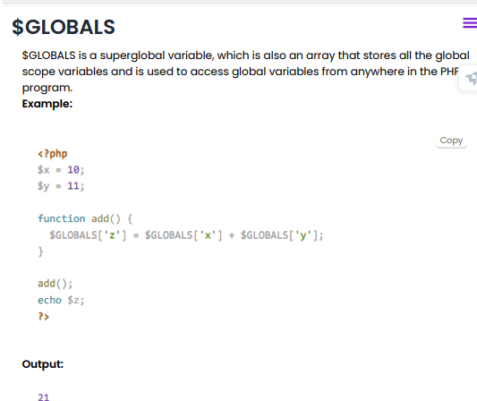
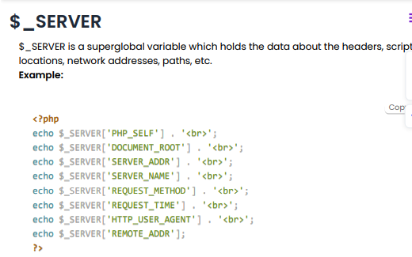
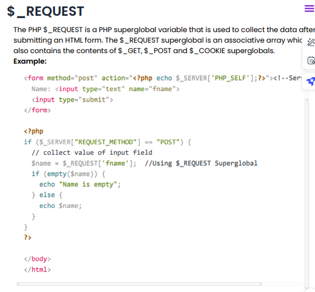

# php ( Hypertext preprocessor)

PHP is a server-side scripting language, which is used to manage dynamic web pages, databases and build websites with features like session tracking and e-commerce.

## Uses of php
- **Web Development**: PHP is used to build dynamic websites and web applications. 
-  **Server-side scripting**: PHP is used to manage dynamic web pages, databases and build websites with features
-  **Handling Forms**
-  **Database Operations**
  
<br>

## Variables:

```php

<?php
$txt = "Hello world!";  # Type String
$x = 5;                        # Type int
$y = 10.5;         # Type Float
?>
```

<br>

## Global & local Variables:

```php

<?php  
    $name = "Harry Bhai";        //Global Variable  
    function global_var()  
    {  
        global $name;  
        echo "Variable inside the function: ". $name;  
        echo "</br>";
        
        $dept ="IT"; //local variable
        echo "Variable inside the function(local): ". $dept;
    }  
    global_var();  
    echo "Variable outside the function: ". $name;  
?>  
```

# Static Variable:
PHP has a feature that deletes the variable once it has finished execution and frees the memory. When we need a local variable which can store its value even after the execution, we use the static keyword before it and the variable is called static variable.

```php
<?php  
    function static_var()  
    {  
        static $num1 = 3;    //static variable  
        $num2 = 6;          //Non-static variable  
        //increment in non-static variable which will increment its value to 7
        $num1++;  
        //increment in static variable which will increment its value to 4 after first execution and 5 after second execution
        $num2++;  
        echo "Static: " .$num1 ."</br>";  
        echo "Non-static: " .$num2 ."</br>";  
    }  


//first function call  
    static_var();  //4,7

//second function call  
    static_var();  //5,7
?>  
```
<br>

## `var_dump() function returns the data type and the value:`

<br>

## Conditional statements:

### if-else
```php
<?php
$x = "22";
if ($x == "22") {
  echo "correct guess";
} else if ($x < "22") {
  echo "Less than 22";
} else {
  echo "Greater than 22";
}
?>
```

### switch

```php
<?php
$i = "2";
switch ($i) {
    case 0:
        echo "i equals 0";
        break;
    case 1:
        echo "i equals 1";
        break;
    case 2:
        echo "i equals 2";
        break;
    default:
       echo "i is not equal to 0, 1 or 2";
}
?>
```
<br>

## loops:
**While loop** in PHP is used when we need to execute a block of code again and again based on a given condition.

**do-while** :
it is guaranteed to execute at least once. After executing a part of a program for once, the rest of the code gets executed based on a given boolean condition.

**for loop** is used to iterate a block of code multiple times.

**foreach loop** in PHP can be used to access the array indexes in PHP. It only works on arrays and objects.

<br>

## Functions:
```php
<?php
function helloMsg() {
  echo "Hello world!";
}
helloMsg(); // call the function
?>
```
<br>

1. Call by Value
In Call by Value, the value of a variable is passed directly. This means if the value of a variable within the function is changed, it does not get changed outside of the function. 

Example:
```php
<?php  
function incr($i)  
{  
    $i++;  
}  
$i = 5;  
incr($i);  
echo $i;  //5
?>  
```
2. Call by Reference
In call by reference, the address of a variable (their memory location) is passed. In the case of call by reference, we prepend an ampersand (&) to the argument name in the function definition. Any change in variable value within a function can reflect the change in the original value of a variable.


```php
<?php  
function incr&$i)  
{  
    $i++;  
}  
$i = 5;  
incr($i);  
echo $i;  //6
?>  
```
3. Default Argument Values
If we call a function without arguments, then PHP function takes the default value as an argument. 

```php

<?php  
function Hello($name="Aakash"){  
echo "Hello $name <br>";  
}  
Hello("Rohan");  
Hello();//passing no value  
Hello("Lovish");  
?>  

Output:

Hello Rohan
Hello Aakash
Hello Lovish
```
 

4. Variable Length Argument
It is used when we need to pass n number of arguments in a function. To use this, we need to write three dots inside the parenthesis before the argument. 

```php
<?php  
function add(...$nums) {  
    $sum = 0;  
    foreach ($nums as $n) {  
        $sum += $n;  
    }  
    return $sum;  
} 
echo add(1, 2, 3, 4);  //10
?>  
```

<br>

## Arrays:

```php
<?php
$bike = array("TVS", "YAMAHA", "RAJDOOT");
echo "I like " . $bike[0] . ", " . $bike[1] . " and " . $bike[2] . ".";
?>

<?php
$age = array("Ben"=>"35", "Stokes"=>"37", "Jimi"=>"43");
echo "Ben is " . $age['Ben'] . " years old.";
?>

<?php
$cars = array (
  array("Volvo",22,18),
  array("BMW",15,13),
  array("Saab",5,2),
  array("Land Rover",17,15)
);
echo $cars[0][0].": In stock: ".$cars[0][1].", sold: ".$cars[0][2].".<br>";
?>
```
<br>

## OOP

```php
<?php

class Employee {
  // Properties
  public $name;
  public $surname;

  // Methods
  function set_name($name) {
    $this->name = $name;
  }
  function get_name() {
    return $this->name;
  }
}
//objects
$emp1 = new Employee();
$emp2= new Employee();
$emp1->set_name('Harry');
$emp2->set_name('Shayan');

echo $emp1->get_name();
echo "<br>";
echo $emp2->get_name();
?>

```
### inheritance:

```php
<?php  
    class exm {  
        public function func1()  
        {  
            echo "example of inheritance  ";  
        }     
    }  
    class exm1 extends exm {  
        public function func2()  
        {  
            echo "in php";  
        }     
    }  
    $obj= new exm1();  
    $obj->func1();  
    $obj->func2();  
?>
```
### Constuctor and sestructors:

```php
function __construct($name) {
    $this->name = $name;
  }
  function __destruct() {
    echo "Employee name is {$this->name}.";
  }
```
### interface:

```php
<?php
interface Human {
  public function makeSound();
}

class Programmer implements Human{
  public function makeSound() {
    echo "Hello World";
  }
}

$human = new Programmer();
$human->makeSound();
?>
//other methods
<?php
interface InterfaceName {
  public function Method1();
  public function Method2($name, $surname);
  public function Method3() : string;
}
?>
```

### Abstact class
Abstract classes and methods are when the parent class has a named method but the child class needs to complete the task.

An abstract class is a class that contains at least one abstract method. Abstract methods are methods that are declared in your code but not implemented.

```php
<?php
// Parent class
abstract class Bike {
  public $name;
  public function __construct($name) {
    $this->name = $name;
  }
  abstract public function intro() : string; 
}

// Child classes
class Yamaha extends Bike {
  public function intro() : string {
    return "I'm a $this->name!"; 
  }
}

class splendor extends Bike {
  public function intro() : string {
    return "I'm a $this->name!"; 
  }
}

class Vespa extends Bike {
  public function intro() : string {
    return "I'm a $this->name!"; 
  }
}

// Create objects from the child classes
$yamaha = new yamaha("Yamaha");
echo $yamaha->intro();
echo "<br>";

$splendor = new splendor("Splendor");
echo $splendor->intro();
echo "<br>";

$vespa = new vespa("Vespa");
echo $vespa->intro();
?>
```
<br>

## Traits:
Traits
PHP language only supports single-level inheritance where a child class can inherit only from one single parent. If we need to inherit multiple behaviours from a class, then we can use Traits to solve this. 

```php
<?php
trait message1 {
public function msg1() {
    echo "give me cheeseburgers ";
  }
}

class Welcome {
  use message1;
}

$obj = new Welcome();
$obj->msg1();
?>
```
<br>

## Static Methods:
```php
<?php
class greeting {
  public static function welcome() {
    echo "Hello Bhai!";
  }
  public function __construct() {
    self::welcome();
  }
}

// Call static method
greeting::welcome();
?>
```

<br>

## Superglobals







## `Information sent from an HTML form with the GET method is displayed in the browser's address bar making it less secure than POST. `

## $_COOKIE

- Cookie is a small file that the server embeds on the user's computer. Each time the computer opens a webpage, the server will send a cookie to the computer. PHP contains  setcookie function to create a cookie object to be sent to the client along with HTTP response.


```php

<?php
$cookie_name = "username";
$cookie_value = "rohan";
//The setcookie() function must appear BEFORE the <html> tag.
setcookie($cookie_name, $cookie_value, time() + (86400 * 30), "/"); // 86400 = 1 day
?>
<html>
<body>

<?php
if(!isset($_COOKIE[$cookie_name])) {
  echo "Cookie named '" . $cookie_name . "' is not set!";
} else {
  echo "Cookie '" . $cookie_name . "' is set!<br>";
  echo "Value is: " . $_COOKIE[$cookie_name];
}
?>

//Modify cookie
<?php
if(!isset($_COOKIE[$cookie_name])) {
  echo "Cookie named '" . $cookie_name . "' is not set!";
} else {
  echo "Cookie '" . $cookie_name . "' is set!<br>";
  echo "Value is: " . $_COOKIE[$cookie_name];
}
?>


</body>
</html>
```

## Delete cookie:
To delete a cookie, we need to use the setcookie() function with a date that has already expired. 
```php
<?php
// set the expiration date to one day ago
setcookie("username", "", time() - 86400);
?>
<html>
<body>

<?php
echo "Cookie 'user' is deleted.";
?>

</body>
</html>
```
<br>

## include

The include statement is used when we need to include one PHP file in another PHP file. If the file does not exist on the server, then the PHP script will produce a warning and then show us the output. 

```php
<html>
<body>

<h1>Welcome!</h1>
<p>Let's get started</p>
<?php include 'example1.php';?>

</body>
</html>
```
<br>

## Require:
We can also use the require statement to include a file into a PHP program. There is only one big difference between include and require which makes require unique; when a file is included using the require statement and if the server cannot find the file then the script will produce an error and stop executing the script. 


